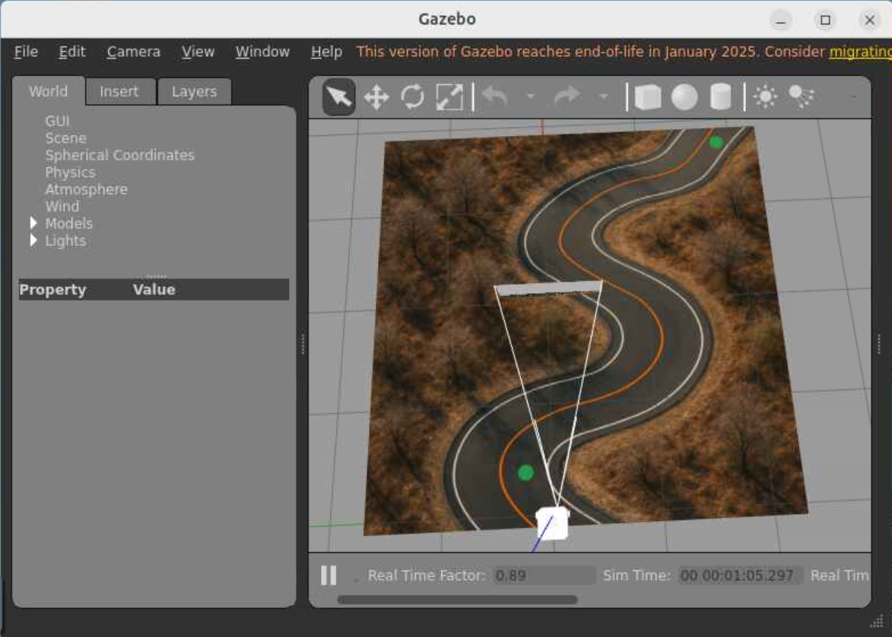
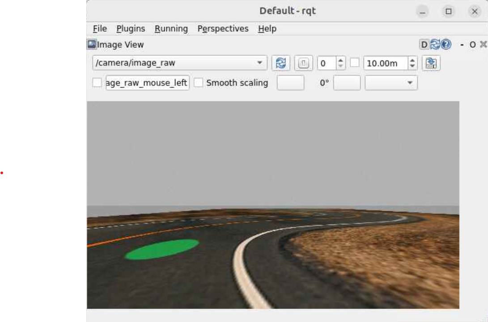

# Curvy Road World

___
The Curvy Road World is a Gazebo world created for this class as a testbed for lane following.  



# Installation

Clone this repo into your workspace `humble_ws/src` folder.  
```
humble:~/av/humble_ws/src$ git clone https://gitlab.msu.edu/av/curvy_road.git
```
Then build it from the `humble_ws` folder with:
```
humble:~/av/humble_ws$ colcon build --packages-select curvy_road
```
You can safely ignore the warning about `find_package_handle_standard_args` (PkgConfig).

And finally, source your overlay:
```
humble:~/av/humble_ws$ source install/setup.bash
```

# Start the World

Run the world in Gazebo with:
```
ros2 launch curvy_road curvy_road.launch.py
```

# Control the Turtlebot

You can control the Turtlebot the same way as usual, namely by publishing a `Twist` to the `/cmd_vel` topic.  For example:
```
ros2 topic pub /cmd_vel geometry_msgs/msg/Twist '{linear: {x: 0.2}, angular: {z: -0.2}}' -1
```
Stop the Turtlebot with an all-zero Twist, namely:
```
ros2 topic pub /cmd_vel geometry_msgs/msg/Twist '{}' -1
```
Alternatively, you can teleoperate the Turtlebot with the command:
```
ros2 run teleop_twist_keyboard teleop_twist_keyboard
```
# Reset the Turtlebot

To reset the Turtlebot to its starting location, simply select `Edit / Reset Model Poses` from the Gazebo menu.

# Image Topic

Gazebo shows a Turtlebot-centric view of the camera image.  But you can also directly view the image using `rqt`.  Simply type:
```
rqt
```
Then select `Plugins / Visualization / Image View`, and under the image topic select: `/camera/image_raw`.  You should see something like this:



